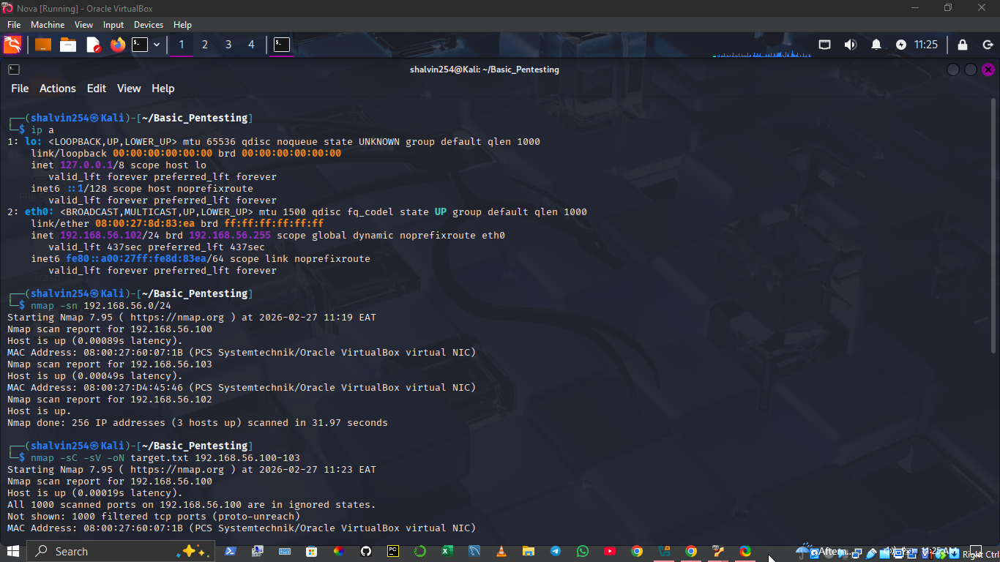

# Basic Pentesting 1 - Penetration Test Report

## Project Information
**Target machine:** Basice Pentesting 1
**Attacker Machine:** Kali Linux 
**Methodology:** Black-box penetration testing

The target machine **Basic Pentesting 1** was acquired from **VulnHub**, a publicly available platform with intentionally vulnerable machines to practice hands-on hacking skills *legally*


---

## Objective

The objective of this penetration test was to:
- Discover active hosts
- Identify active ports and services
- Enumerate vulnerabilities
- Exploit identified vulnerabilities
- Gain unauthorized system access
- Demonstrate proof of compromise
---

## Lab Environment

| Machine | Role | IP Address |
|---------|------|------------|
| Kali Linux | Attacker | 192.168.56.101 |
| Basic Pentesting 1 | Target | 192.168.56.103 |

Both machines were configured on the same Host-Only Network using VirtualBox
---

## Methodology
1. Reconnaissance
2. Enumeration
3. Vulnerability Discovery
4. Exploitation
5. Post-Exploitation
6. Documentation

---

## Scope

This test focused only on the target machine: 
```bash
192.168.56.103
```
No other systems were targeted.
---

## Phase 1: Host Discovery
The first step was to discover active hosts on the network
The attacker machine IP was identified using:

```bash
ip a
```
The network range was determined to be:
```code
192.168.56.0/24
```

A ping scan was performed using Nmap to discover active hosts
```bash
nmap -sn 192.168.0/24
```

#### Scan Results
Active hosts discovered:
```code
192.168.56.100
192.168.56.102
192.168.56.103
```
The attacker machine IP was:
```bash
192.168.56.102
```
The remaining host was identified as the target machine:
```bash
192.168.56.103
```

The target machine was successfully identified and confirmed reachable.

The following screenshot shows active hosts discovered on the network:


---

## Phase 2: Port Scanning and Service Enumeration
**Command Used:** 
```bash
nmap -sC -sV -oN target.txt 192.168.56.100-103
```
**Command Explanation**
- -sC -> Runs default NSE scripts for basic enumeration
- -sV -> Detects service versions
- -oN -> Saves output to a file (in this case the file is *target.txt*)
- 192.168.56.103 -> Target machine IP

---

#### Scan Results
The scan revealed two open ports:
| PORT | STATE | SERVICE | VERSION |
|------|-------|---------|---------|
|21/tcp| open |   ftp   |ProFTPD 1.3.3c|
|22/tcp| open | ssh     |OpenSSH 7.2p2 Ubuntu|

---

#### Service Analysis
Two services were discovered:

**FTP Service (Port 21)**
- Service: ProFTPD
- Version: 1.3.3c
- This version is known to contain a backdoor vulnerability

**SSH Service (Port 22)**
- Service: OpenSSH
- Version: 7.2p2
- Used for secure remote login

The FTP service running ProFTPD was identified as a potential entry point for exploitation.

The following screenshot shows ports discovered and services running on the target machine:


---


